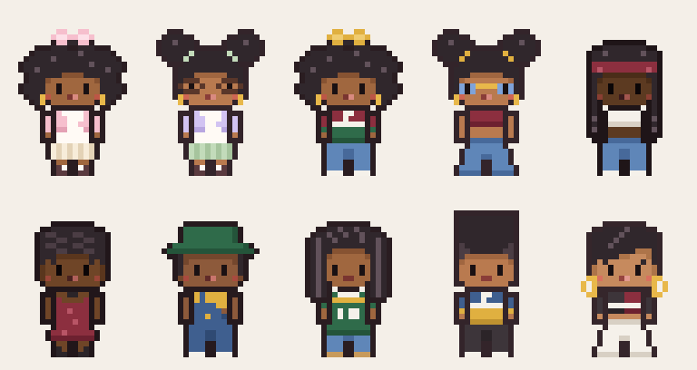
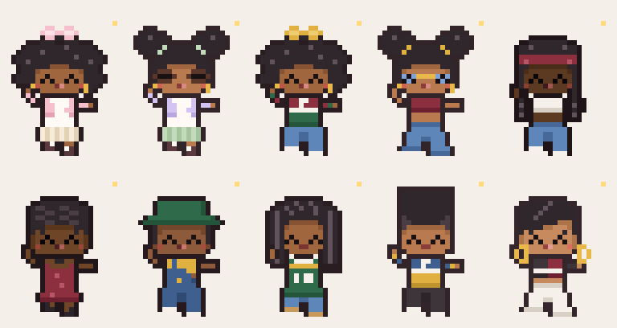

# desk-sprites 🎀

Ten pixel characters I made for [Pixel Agent Desk](https://github.com/zep-ia/pixel-agent-desk), the little app that turns your Claude Code sessions into people working in a pixel office.



## Why I made these

I wanted more characters that look like me. Black girls with a clean girl aesthetic, a 90s R&B crew, hair like mine. I hadn't seen much of that in pixel art, so I made my own.

They started as a fun side quest while I was building something else, and now they're my favorite little crew.

## The two looks

**Me, twice.** The bow and puffs characters are both me, in a soft girl meets clean girl style: pastel cropped cardigans, pleated skirts, mary janes, small gold hoops, a little lip gloss.

**A 90s Black R&B crew.** Everyone else is dressed for the era I love: box braids, finger waves, bucket hats, locs, high-top fades, laid edges. Baggy denim, color-block windbreakers, a satin slip dress. They're inspired by the fashion of the time, not based on any real person.

I also gave my two a 90s outfit each, so they can hang out with the crew.



## Six skin tones

From deep to light warm:

| Tone | Who |
|---|---|
| `#5C3A21` | braids |
| `#6F4527` | finger waves |
| `#8D5A3B` | bucket hat |
| `#A0673F` | bow, locs |
| `#B97A4F` | puffs, high-top fade |
| `#C68A5E` | pixie |

Each tone has its own shadow, blush, lip, and outline color. One blush for everybody doesn't work: pale pink goes chalky on brown skin, so mine is a terracotta that gets deeper and redder as the skin does. The outline gets darker on the deeper tones too, so there's always a clear edge around the face.

## The ten

In the same order as the pictures, left to right, top row first:

1. **`bow_soft`** is me. Big round curls with a pink bow, a pink cropped cardigan, a cream pleated skirt, and mary janes.
2. **`puffs_soft`** is also me. Two puffs with sage hair ties, small round glasses, a lavender cardigan, and a sage pleated skirt.
3. **`bow_90s`** has the same curls with a mustard bow, a burgundy, white, and forest green windbreaker, and baggy jeans.
4. **`puffs_90s`** has the puffs with mustard ties, tiny blue tinted shades, a burgundy crop top, and wide-leg jeans.
5. **`braids`** has long box braids under a burgundy bandana, a white crop top, and baggy light denim.
6. **`waves`** has finger waves with laid edges, a burgundy satin slip dress, and a black choker.
7. **`bucket`** has short hair under a forest green bucket hat, and dark denim overalls with one strap down over a mustard crop top.
8. **`locs`** has shoulder-length locs, an oversized forest green jersey with a mustard stripe, baggy jeans, and tan work boots.
9. **`hightop`** has a high-top fade, an indigo, white, and mustard windbreaker, and baggy black pants.
10. **`pixie`** has a pixie cut with laid edges, a cropped black and burgundy jacket, white wide-leg pants, and big gold hoops that swing when she dances.

Every character has all 18 animations the app uses: idle, walking, sitting, and typing in four directions, plus a happy dance and an alert jump.

## Using them in Pixel Agent Desk

1. Copy the files from `sprites/` into the app's `public/characters/` folder.
2. Open `public/shared/avatars.json` in the app and list the ones you want. That list is what the app picks from for each session.
3. Quit and restart the app.

Two things that tripped me up:

- **The office might keep showing the old characters.** The dashboard window caches that list for up to an hour, even across restarts. If that happens, quit the app and delete its `Cache` folder (on a Mac: `~/Library/Application Support/pixel-agent-desk/Cache`).
- **The idle character is hardcoded.** The app uses `avatar_0.webp` when no session is running. If you remove the app's own characters, change `idleAvatar` in `src/renderer/init.js` to one of these, or the idle spot goes blank.

This was true for the app as of March 2026. If it has changed since, the steps might need adjusting.

## How they're drawn

I drew these with code instead of a pixel editor. `parts.py` holds every head, outfit, and color as rows of letters, one letter per pixel. `draw_character.py` stacks the pieces into frames and builds all 18 animations from small nudges: a head dipping one pixel to breathe, a leg lifting to walk.

I did it this way because one base drawing per direction gives me every animation for free, and changing a skin tone or an outfit color is a one-line edit. The tradeoff is that everyone shares the same body and the same moves.

To redraw everything (Python 3.9 or newer):

```bash
pip install pillow
python3 draw_character.py
```

That rewrites the sheets in `sprites/` and both preview pictures. Open `preview.html` in a browser afterward to watch every animation.

The sheets are 384×576 WebP files: 8 columns by 9 rows of 48×64 frames, drawn at 2×2 "chunky" pixels to match the app's own characters.

### What I'd still like to fix

- Eyes are hardest to see on the two deepest skin tones. I made them blacker there, but they're still the lowest contrast in the set.
- The finger waves are subtle. A brighter highlight made them look like a striped hat.
- The glasses only fit the puffs hairstyle.
- A hoop earring three pixels wide can only be so round.

## Licenses

- **The art** (everything in `sprites/`, `preview.png`, `dance.gif`, and the drawings in `parts.py`) is [CC BY 4.0](LICENSE-ART). Use it, change it, even sell things with it. Just credit me, Malika Pixels, and link back here.
- **The code** (`draw_character.py` and `preview.html`) is [MIT](LICENSE). Do what you like with it and keep the copyright notice.

## Credit

Made for [Pixel Agent Desk](https://github.com/zep-ia/pixel-agent-desk). Thanks to zep-ia for making such a fun app to build for.

None of that app's own artwork or files are in this repo, since its art license doesn't allow sharing them.
